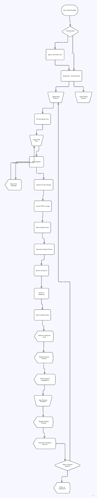

# ResuRate 🎯

> **AI-Powered Resume Analysis & ATS Optimization Tool**

ResuRate is an intelligent resume evaluation platform that helps job seekers optimize their resumes for Applicant Tracking Systems (ATS) and improve their chances of landing their dream job. Get instant AI-powered feedback, ATS compatibility scores, and actionable improvement suggestions.

## 🚀 Problem Statement

In today's competitive job market, **over 75% of resumes are rejected by ATS systems** before they even reach human recruiters. Job seekers face several critical challenges:

- **ATS Filtering**: Resumes get automatically rejected due to poor formatting, missing keywords, or incompatible structure
- **Lack of Feedback**: Traditional job applications provide no insight into why applications are rejected
- **Generic Resumes**: One-size-fits-all resumes don't match specific job requirements
- **Time Consuming**: Manual resume optimization is time-intensive and often ineffective

## 💡 Our Solution

ResuRate tackles these challenges through:

### 🎯 **AI-Powered Analysis**
- Advanced AI algorithms analyze resume content, structure, and ATS compatibility
- Industry-specific feedback tailored to job descriptions
- Comprehensive scoring across multiple dimensions

### 📊 **Multi-Dimensional Scoring**
- **Overall Score**: Holistic resume quality assessment
- **ATS Compatibility**: Technical formatting and keyword optimization
- **Content Quality**: Relevance, achievements, and impact statements
- **Structure & Format**: Layout, organization, and readability
- **Tone & Style**: Professional language and consistency
- **Skills Alignment**: Match with job requirements

### 🔄 **Iterative Improvement**
- Actionable suggestions with detailed explanations
- Before/after tracking of improvements
- Job-specific optimization recommendations

## ✨ Key Features

### 📤 **Smart Upload System**
- Drag-and-drop PDF upload interface
- Automatic PDF to image conversion for preview
- File validation and size optimization

### 🤖 **AI-Powered Feedback**
- Context-aware analysis based on job descriptions
- Detailed improvement suggestions
- Industry best practices integration

### 📈 **Comprehensive Analytics**
- Visual score representations (gauges, circles, badges)
- Category-wise breakdown of strengths and weaknesses
- Trend tracking across multiple submissions

### 🔐 **Secure Data Management**
- Authentication-based access control
- Encrypted file storage via Puter SDK
- Privacy-focused data handling

### 📱 **Responsive Interface**
- Modern, intuitive user experience
- Mobile-friendly design
- Real-time feedback display

## 🛠️ Tech Stack

### **Frontend**
- **React 18** - Modern UI framework
- **TypeScript** - Type-safe development
- **React Router v7** - Client-side routing
- **Tailwind CSS** - Utility-first styling
- **Vite** - Fast build tooling

### **Backend Services**
- **Puter SDK** - Cloud backend platform
    - Authentication system
    - File storage and management
    - AI/ML services integration
    - Key-value data store

### **AI & Analysis**
- **PDF.js** - Client-side PDF processing
- **Canvas API** - PDF to image conversion
- **Claude AI** - Advanced resume analysis

### **Development Tools**
- **ESLint** - Code quality
- **Prettier** - Code formatting
- **TypeScript** - Static typing

## 📋 How ResuRate Works



## 🔧 Installation & Setup

### Prerequisites
- Node.js 18+
- npm or yarn package manager
- Puter account (for backend services)

### 1. Clone Repository
```bash
git clone https://github.com/yourusername/ResuRate.git
cd ResuRate
```

### 2. Install Dependencies
```bash
npm install
# or
yarn install
```

### 3. Environment Configuration
Create a `.env` file in the root directory:
```env
VITE_PUTER_API_URL=https://api.puter.com
VITE_APP_NAME=ResuRate
```

### 4. Development Server
```bash
npm run dev
# or
yarn dev
```

The application will be available at `http://localhost:5173`

### 5. Build for Production
```bash
npm run build
# or
yarn build
```

## 📖 Usage Guide

### 1. **Authentication**
- Visit the application and sign in using Puter authentication
- New users will be automatically registered

### 2. **Upload Resume**
- Click "Upload Resume" from the dashboard
- Fill in job details (Company, Position, Job Description)
- Drag and drop your PDF resume or click to browse
- Click "Analyze Resume" to start the process

### 3. **Review Analysis**
- View your overall score and category breakdowns
- Read detailed feedback and improvement suggestions
- Download or share your analysis results

### 4. **Manage Data**
- Use the "Wipe Data" feature to clear all stored information
- Sign out securely when finished


## 🎯 Key Benefits

### For Job Seekers
- **Increase ATS Pass Rate**: Optimize resumes for automated screening systems
- **Personalized Feedback**: Get specific, actionable improvement suggestions
- **Time Efficient**: Quick analysis saves hours of manual optimization
- **Multi-Job Optimization**: Tailor resumes for different positions and companies

### For Recruiters
- **Quality Candidates**: Encourage better resume submissions
- **Standardized Evaluation**: Consistent criteria for resume assessment
- **Reduced Screening Time**: Pre-filtered, optimized applications

## 🔒 Security & Privacy

- **Secure Authentication**: Puter-based auth system with encryption
- **Data Protection**: All files stored securely in Puter cloud
- **Privacy First**: No data sharing with third parties
- **User Control**: Complete data ownership and deletion capabilities

## 🚀 Future Enhancements

- [ ] **Multi-format Support**: Word documents, Google Docs integration
- [ ] **Industry Templates**: Pre-built templates for different sectors
- [ ] **Collaboration Features**: Share and get feedback from mentors
- [ ] **Interview Prep**: AI-powered interview question generation
- [ ] **Job Matching**: Automatic job recommendation based on resume
- [ ] **Mobile App**: Native iOS and Android applications
- [ ] **Integration APIs**: LinkedIn, Indeed, and other job platforms

## 🤝 Contributing

We welcome contributions! Please follow these steps:

1. **Fork the Repository**
2. **Create a Feature Branch**
   ```bash
   git checkout -b feature/amazing-feature
   ```
3. **Make Your Changes**
    - Follow existing code style and conventions
    - Add tests for new functionality
    - Update documentation as needed

4. **Commit Your Changes**
   ```bash
   git commit -m 'Add amazing feature'
   ```
5. **Push to Branch**
   ```bash
   git push origin feature/amazing-feature
   ```
6. **Open a Pull Request**

### Development Guidelines
- Use TypeScript for type safety
- Follow React best practices and hooks patterns
- Write descriptive commit messages
- Ensure responsive design compatibility
- Test across different browsers and devices

## 📄 License

This project is licensed under the MIT License - see the [LICENSE](LICENSE) file for details.

## 🙏 Acknowledgments

- **Puter.com** - For providing the backend infrastructure and AI services
- **PDF.js Mozilla** - For client-side PDF processing capabilities
- **React Router Team** - For the excellent routing solution
- **Tailwind CSS** - For the utility-first CSS framework

## 📞 Support & Contact

- **Issues**: Report bugs and request features via [GitHub Issues](https://github.com/yourusername/ResuRate/issues)
- **Discussions**: Join our community discussions
- **Email**: support@resumate.app (if applicable)

---

**Made with ❤️ for job seekers worldwide**

*Transform your resume, transform your career with ResuRate* ✨